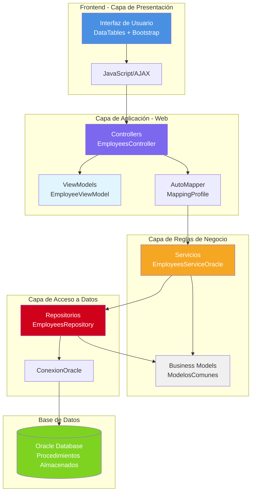
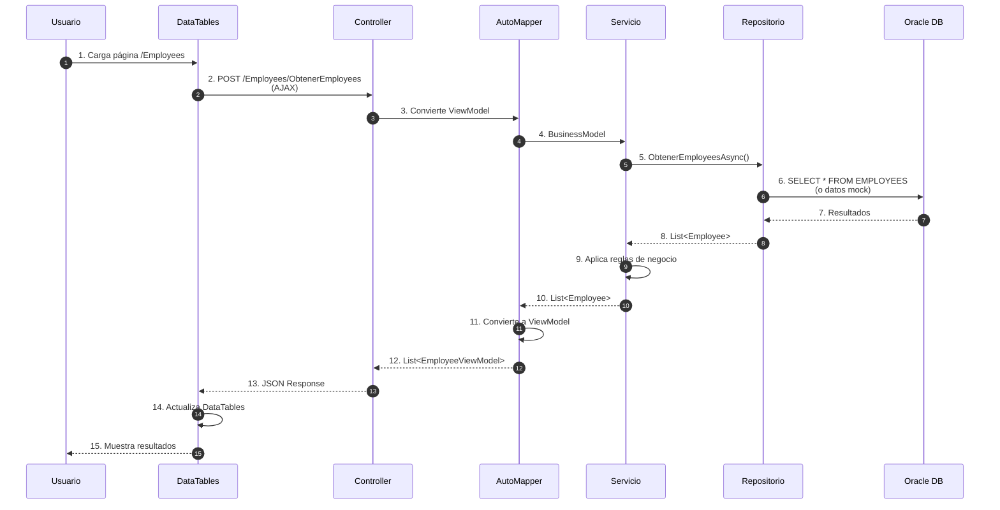
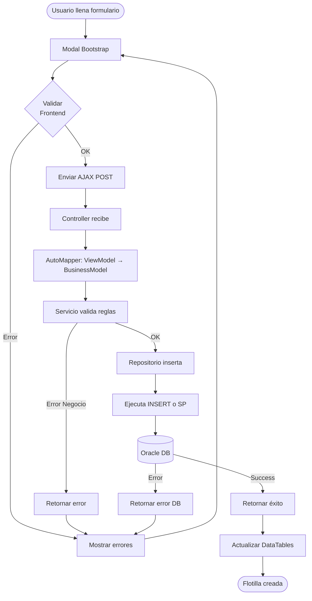
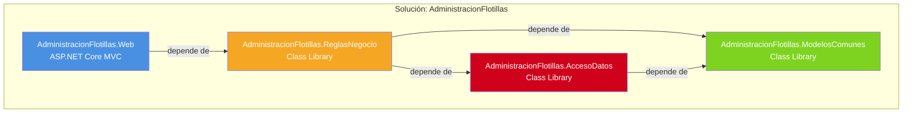
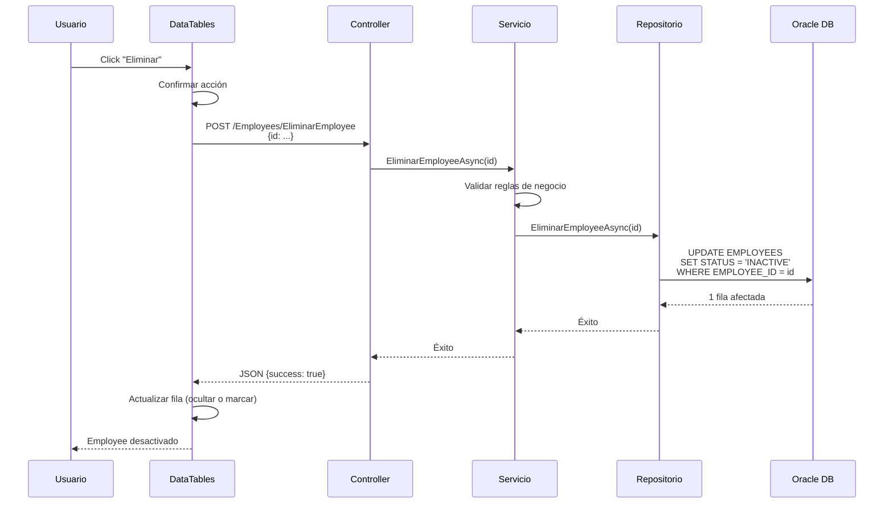
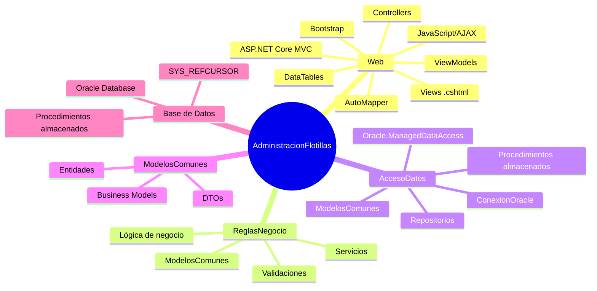

# Arquitectura del Proyecto AdministracionFlotillas

## Diagrama General de Arquitectura

## Flujo Completo de una Petición

## Estructura de Capas y Responsabilidades

## Flujo de Creación de una Flotilla (CRUD)

## Flujo de Búsqueda con Filtros

```mermaid
flowchart LR
    A[Usuario ingresa filtros] --> B[DataTables aplica filtros]
    B --> C[Enviar petición AJAX]
    C --> D[Controller recibe filtros]
    D --> E[AutoMapper convierte]
    E --> F[Servicio procesa]
    F --> G[Repositorio construye query]
    G --> H[Ejecuta SELECT con WHERE]
    H --> I[(Oracle DB)]
    I --> J[Retorna resultados]
    J --> K[Transforma resultados]
    K --> L[AutoMapper convierte a ViewModel]
    L --> M[Retorna JSON]
    M --> N[DataTables actualiza]
    N --> O[Usuario ve resultados]
```

## Estructura de Proyectos y Dependencias

## Flujo de Eliminación Lógica (por Status)

## Componentes y Tecnologías por Capa

---

**Última actualización**: Enero 2026

