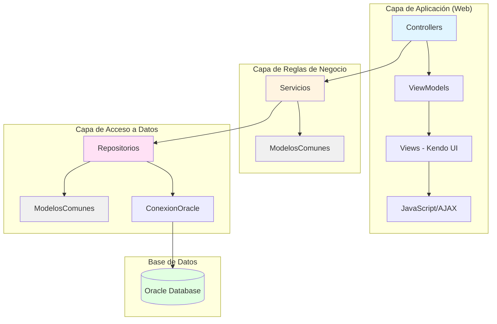
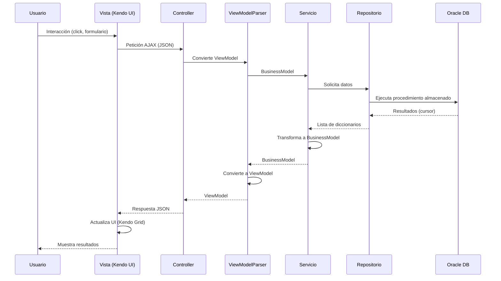
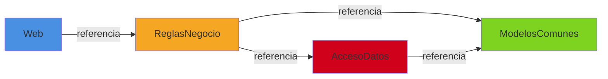

# Cómo Continuar - Gu�a Paso a Paso Granular

##  Compatibilidad Multiplataforma

 **.NET 10.0.101** funciona perfectamente en:
-  **Mac** (Rider, DataGrip) - Desarrollador principal
-  **Windows** (VS Code) - Equipo de desarrollo
-  Mismo código, mismos comandos (solo cambian las rutas)

** ¿No tienes las herramientas instaladas?**
- Ver [INSTALACION_HERRAMIENTAS.md](./INSTALACION_HERRAMIENTAS.md) para gu�a completa paso a paso de instalación en Mac y Windows

## Estado Actual

**Lo que YA tienes (COMPLETADO):**
- [x] Solución creada: `AdministracionFlotillas.slnx`
- [x] Proyecto AccesoDatos creado y agregado a la solución
- [x] Proyecto ModelosComunes creado y agregado a la solución
- [x] Proyecto ReglasNegocio creado y agregado a la solución
- [x] Proyecto Web (MVC) creado y agregado a la solución
- [x] Todas las referencias entre proyectos configuradas
- [x] Documentación creada en carpeta `docs/`

**Pendiente para implementación completa:**
- [ ] Instalar Microsoft.AspNetCore.Mvc.NewtonsoftJson en Web
- [ ] Instalar Oracle.ManagedDataAccess.Core en AccesoDatos
- [ ] Configurar base de datos remota gratuita
- [ ] Configurar Kendo UI y Bootstrap
- [ ] Implementar código de las capas
- [ ] Crear vista principal funcional con Kendo Grid
- [ ] Crear vista parcial funcional
- [ ] Implementar llamadas AJAX/Kendo desde UI
- [ ] Configurar manejo de mensajes (error/success)

## Diagrama de Arquitectura del Proyecto



## Flujo de Datos en la Aplicación



## Estructura de Referencias entre Proyectos



## Próximos Pasos

### Paso 1: Verificar ubicación

```bash
# Abre la terminal y navega al proyecto
cd /Users/wallfacer/Documents/AdministracionFlotillas

# Verifica que estás en el lugar correcto
pwd
# Debe mostrar: /Users/wallfacer/Documents/AdministracionFlotillas
```

### Paso 2: Agregar proyecto a la solución (COMANDO CORRECTO)

```bash
#  IMPORTANTE: Copia este comando EXACTAMENTE como está
# NO debe haber espacios antes de .csproj
dotnet sln add src/AdministracionFlotillas.AccesoDatos/AdministracionFlotillas.AccesoDatos.csproj
```

** Si funciona, verás:**
```
Project `src/AdministracionFlotillas.AccesoDatos/AdministracionFlotillas.AccesoDatos.csproj` added to the solution.
```

** Si ves error, verifica:**
- Que NO haya espacios antes de `.csproj`
- Que estés en la ra�z del proyecto (`/Users/wallfacer/Documents/AdministracionFlotillas`)
- Que el archivo `.csproj` exista en esa ruta

### Paso 3: Verificar que se agregó correctamente

```bash
# Lista los proyectos en la solución
dotnet sln list

# Deber�as ver:
# AdministracionFlotillas.AccesoDatos
```

##  Pasos Siguientes (Después de agregar AccesoDatos)

### 1. Crear proyecto ModelosComunes  NUEVO

```bash
# Desde la ra�z del proyecto
dotnet new classlib -n AdministracionFlotillas.ModelosComunes -o src/AdministracionFlotillas.ModelosComunes

# Agregar a la solución
dotnet sln add src/AdministracionFlotillas.ModelosComunes/AdministracionFlotillas.ModelosComunes.csproj
```

### 2. Crear proyecto ReglasNegocio

```bash
# Desde la ra�z del proyecto
dotnet new classlib -n AdministracionFlotillas.ReglasNegocio -o src/AdministracionFlotillas.ReglasNegocio

# Agregar a la solución
dotnet sln add src/AdministracionFlotillas.ReglasNegocio/AdministracionFlotillas.ReglasNegocio.csproj
```

### 3. Crear proyecto Web (MVC)

```bash
# Desde la ra�z del proyecto
dotnet new mvc -n AdministracionFlotillas.Web -o src/AdministracionFlotillas.Web

# Agregar a la solución
dotnet sln add src/AdministracionFlotillas.Web/AdministracionFlotillas.Web.csproj
```

### 4. Agregar Referencias entre Proyectos

```bash
# Web necesita ReglasNegocio
dotnet add src/AdministracionFlotillas.Web/AdministracionFlotillas.Web.csproj reference src/AdministracionFlotillas.ReglasNegocio/AdministracionFlotillas.ReglasNegocio.csproj

# ReglasNegocio necesita ModelosComunes
dotnet add src/AdministracionFlotillas.ReglasNegocio/AdministracionFlotillas.ReglasNegocio.csproj reference src/AdministracionFlotillas.ModelosComunes/AdministracionFlotillas.ModelosComunes.csproj

# AccesoDatos necesita ModelosComunes
dotnet add src/AdministracionFlotillas.AccesoDatos/AdministracionFlotillas.AccesoDatos.csproj reference src/AdministracionFlotillas.ModelosComunes/AdministracionFlotillas.ModelosComunes.csproj

# ReglasNegocio necesita AccesoDatos
dotnet add src/AdministracionFlotillas.ReglasNegocio/AdministracionFlotillas.ReglasNegocio.csproj reference src/AdministracionFlotillas.AccesoDatos/AdministracionFlotillas.AccesoDatos.csproj
```

### 5. Agregar Paquetes NuGet

**PUNTO DE RETORNO:** Si ya tienes la estructura de proyectos, retoma desde aquí.

```bash
# En AccesoDatos (para Oracle)
cd src/AdministracionFlotillas.AccesoDatos
dotnet add package Oracle.ManagedDataAccess.Core
cd ../..

# En Web (para JSON - NO se usa AutoMapper, se usa parseador manual)
cd src/AdministracionFlotillas.Web
dotnet add package Microsoft.AspNetCore.Mvc.NewtonsoftJson
# Nota: NO se instala AutoMapper, se usa parseador manual en carpeta Parseador/
cd ../..
```

**Siguiente paso:** Ver [PLAN_ANTES_COMPARTIR_REPO.md](./PLAN_ANTES_COMPARTIR_REPO.md) para continuar con la implementación completa.

### 6. Configurar Base de Datos Remota  NUEVO

**Opciones recomendadas:**
1. **Oracle Cloud Free Tier** (recomendado para procedimientos almacenados)
2. **Azure SQL Database Free Tier** (12 meses gratis)
3. **AWS RDS Free Tier** (12 meses gratis)

**Pasos:**
1. Crear cuenta en el servicio elegido
2. Crear base de datos
3. Obtener connection string
4. Configurar en `appsettings.json`
5. Configurar conexión en DataGrip

### 7. Configurar Kendo UI y Bootstrap  NUEVO

```html
<!-- En _Layout.cshtml o _ViewImports.cshtml -->
<!-- Bootstrap (última versión) -->
<link href="https://cdn.jsdelivr.net/npm/bootstrap@5.3.0/dist/css/bootstrap.min.css" rel="stylesheet">

<!-- Kendo UI (última versión) -->
<link href="https://kendo.cdn.telerik.com/latest/styles/kendo.default-main.min.css" rel="stylesheet">
<script src="https://kendo.cdn.telerik.com/latest/js/jquery.min.js"></script>
<script src="https://kendo.cdn.telerik.com/latest/js/kendo.all.min.js"></script>
```

### 8. Crear Repositorio GitHub (Opcional pero Recomendado)

**Nota:** Si estás creando el proyecto desde cero, es recomendable crear el repositorio GitHub al inicio para poder ver en el historial de commits qué archivos se actualizan con cada instalación de dependencias. Si estás colaborando en un repositorio existente, ve a [CLONAR_REPOSITORIO.md](./CLONAR_REPOSITORIO.md).

```bash
# Inicializar git (si no está inicializado)
git init

# Crear .gitignore para .NET
# Ver PLAN_ANTES_COMPARTIR_REPO.md - FASE 0 para .gitignore completo

# Hacer commit inicial (estructura base)
git add .
git commit -m "Estructura inicial del proyecto

- Solución con 4 proyectos (Web, ReglasNegocio, AccesoDatos, ModelosComunes)
- Referencias entre proyectos configuradas
- Documentación inicial en carpeta docs"

# Crear repositorio en GitHub:
# 1. Ve a https://github.com/new
# 2. Nombre: AdministracionFlotillas
# 3. NO inicializar con README, .gitignore o licencia
# 4. Crear repositorio

# Conectar repositorio local con GitHub
# Usando SSH
git remote add origin git@github.com:alejandro3469/AdministracionFlotillas.git

# O usando HTTPS
# git remote add origin https://github.com/alejandro3469/AdministracionFlotillas.git

git branch -M main
git push -u origin main
```

**Después de cada instalación de paquete NuGet:**
```bash
# Hacer commit para ver los cambios
git add .
git commit -m "Agregar paquete [NombrePaquete]

- Instalado [NombrePaquete] v[Version] en [Proyecto]
- [Descripción breve del propósito]"
```

**Ver:** [PLAN_ANTES_COMPARTIR_REPO.md](./PLAN_ANTES_COMPARTIR_REPO.md) - FASE 0 para instrucciones detalladas sobre creación del repositorio

### 5. Verificar que Todo Funciona

```bash
# Desde la ra�z del proyecto
dotnet build

# Si ves "Build succeeded", ¡todo está bien! �
```

##  Solución de Problemas

### Error: "Could not find project or directory"

**Causa:** Espacio extra en el comando

**Solución:**
```bash
#  INCORRECTO (tiene espacio antes de .csproj)
dotnet sln add src/.../Archivo. csproj

#  CORRECTO (sin espacio)
dotnet sln add src/.../Archivo.csproj
```

### Error: "Required argument missing for option: '-o'"

**Causa:** El comando se dividió en dos l�neas

**Solución:** Escribe el comando completo en una sola l�nea:
```bash
dotnet new classlib -n AdministracionFlotillas.ReglasNegocio -o src/AdministracionFlotillas.ReglasNegocio
```

##  Recordatorios Importantes

1. **Siempre verifica dónde estás:**
   ```bash
   pwd
   # Debe ser: /Users/wallfacer/Documents/AdministracionFlotillas
   ```

2. **No dejes espacios en los comandos:**
   - Especialmente antes de `.csproj`
   - Especialmente en el parámetro `-o`

3. **Copia los comandos completos:**
   - No los dividas en múltiples l�neas
   - Copia desde el inicio hasta el final

##  Documentación de Referencia

- **Requisitos del Proyecto**: Ver [REQUISITOS_PROYECTO.md](./REQUISITOS_PROYECTO.md)  NUEVO
- **Gu�a Completa**: Ver `GUIA_PROYECTO_NET_CROSS_PLATFORM.md` en pos-online
- **Seguimiento de Progreso**: Ver [SEGUIMIENTO_PROGRESO.md](./SEGUIMIENTO_PROGRESO.md)
- **Setup Detallado**: Ver [SETUP.md](./SETUP.md)

---

**�ltima actualización**: 12 de Enero, 2026

