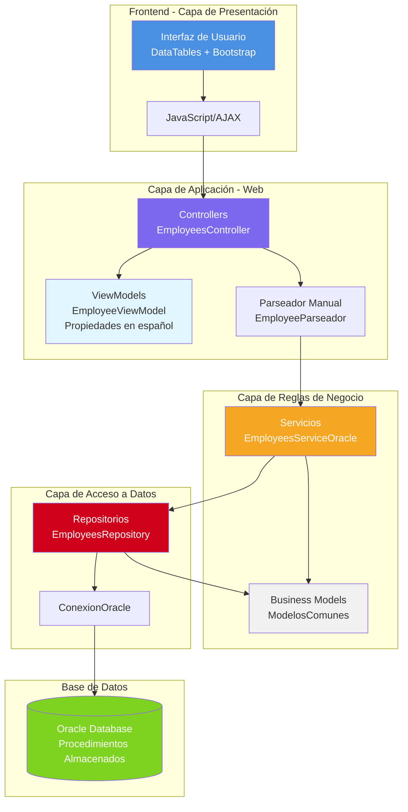
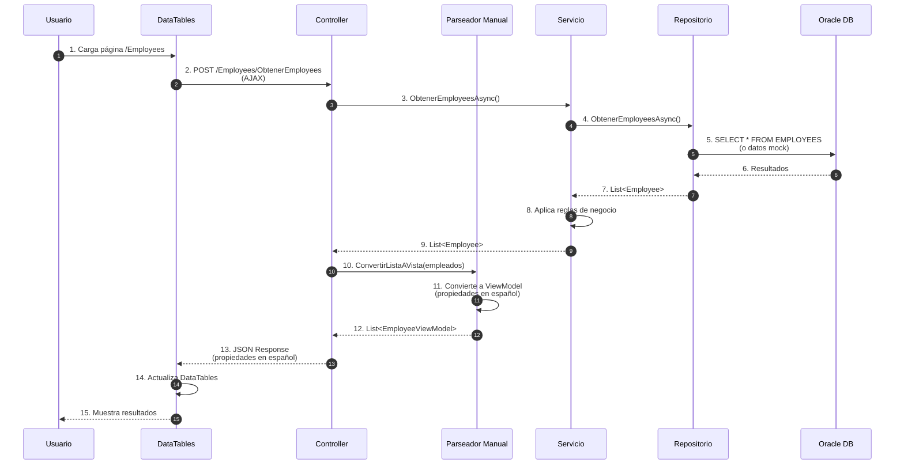
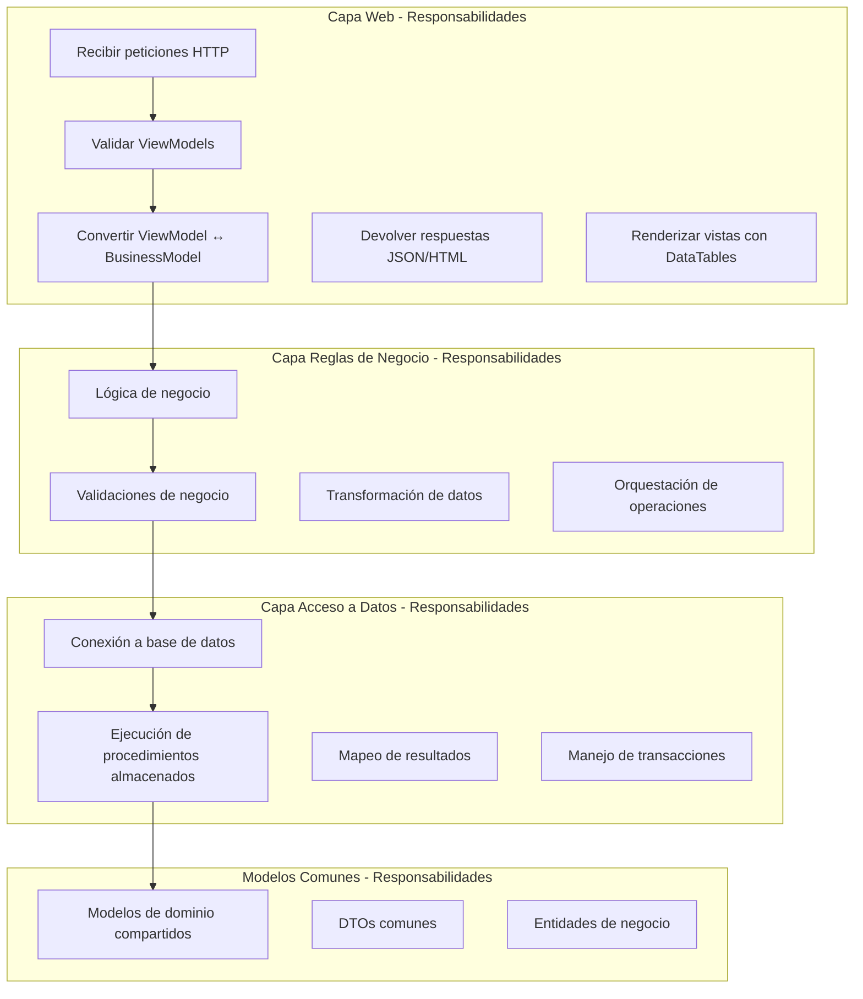
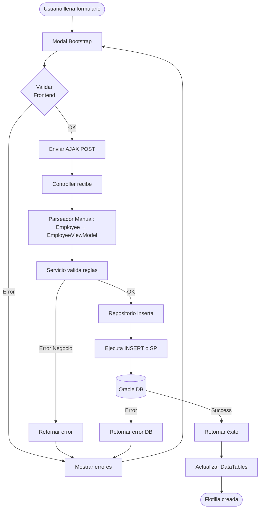
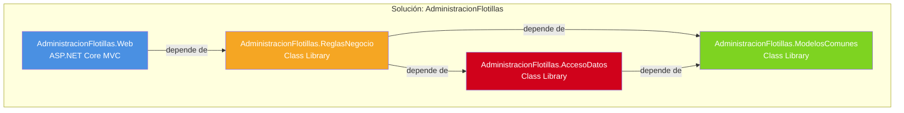
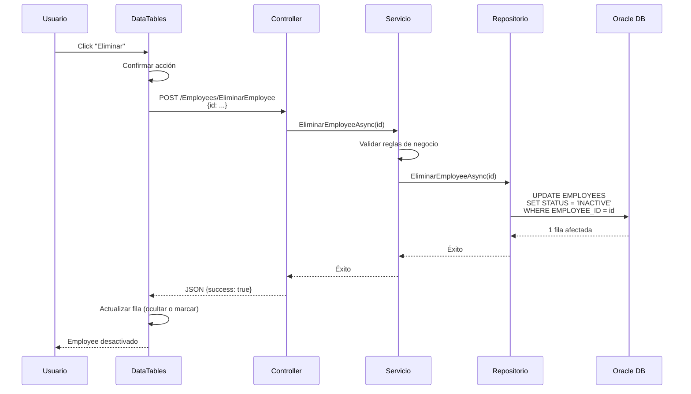
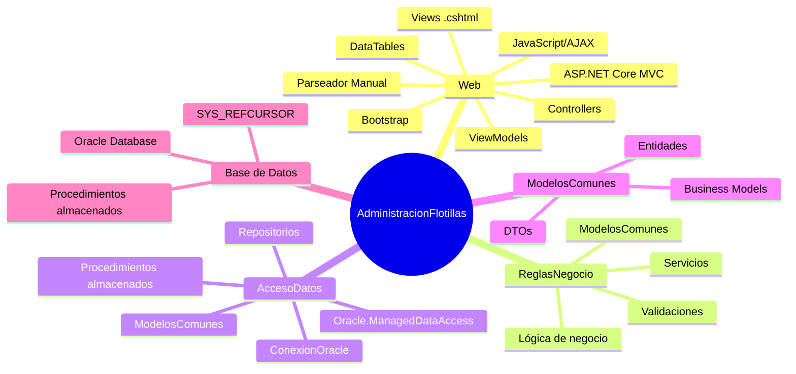

# Arquitectura del Proyecto AdministracionFlotillas

## Diagrama General de Arquitectura



## Flujo Completo de una Petición



## Estructura de Capas y Responsabilidades



## Flujo de Creación de una Flotilla (CRUD)



## Flujo de Búsqueda con Filtros

```mermaid
flowchart LR
    A[Usuario ingresa filtros] --> B[DataTables aplica filtros]
    B --> C[Enviar petición AJAX]
    C --> D[Controller recibe filtros]
    D --> E[Servicio procesa]
    E --> F[Repositorio construye query]
    F --> G[Ejecuta SELECT con WHERE]
    G --> H[(Oracle DB)]
    H --> I[Retorna resultados]
    I --> J[Transforma resultados]
    J --> K[Parseador convierte a ViewModel<br/>(propiedades en español)]
    L --> M[Retorna JSON]
    M --> N[DataTables actualiza]
    N --> O[Usuario ve resultados]
```

## Estructura de Proyectos y Dependencias



## Flujo de Eliminación Lógica (por Status)



## Componentes y Tecnologías por Capa



---

**Última actualización**: Enero 2026

