# Flujos de Negocio - AdministracionFlotillas

**Fecha**: 2026-01-18  
**Versión**: 1.0

---

## Índice

1. [Flujo de Gestión de Órdenes](#flujo-órdenes)
2. [Flujo de Gestión de Productos](#flujo-productos)
3. [Flujo de Gestión de Clientes](#flujo-clientes)
4. [Flujo de Facturación](#flujo-facturación)
5. [Flujo de Inventario](#flujo-inventario)

---

## Flujo de Gestión de Órdenes

### Crear Nueva Orden

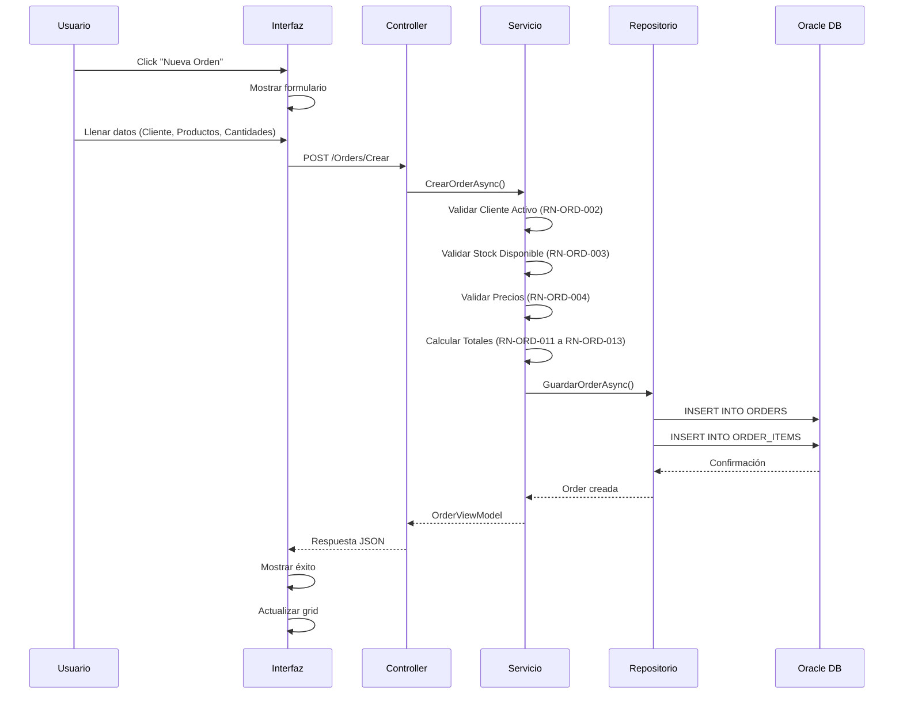

**Reglas de Negocio Aplicadas**:
- RN-ORD-001: Orden debe tener al menos un item
- RN-ORD-002: Cliente debe estar activo
- RN-ORD-003: Productos deben tener stock disponible
- RN-ORD-004: Precio unitario no puede ser menor al precio base
- RN-ORD-006: Tienda debe estar activa

---

### Cambiar Estado de Orden

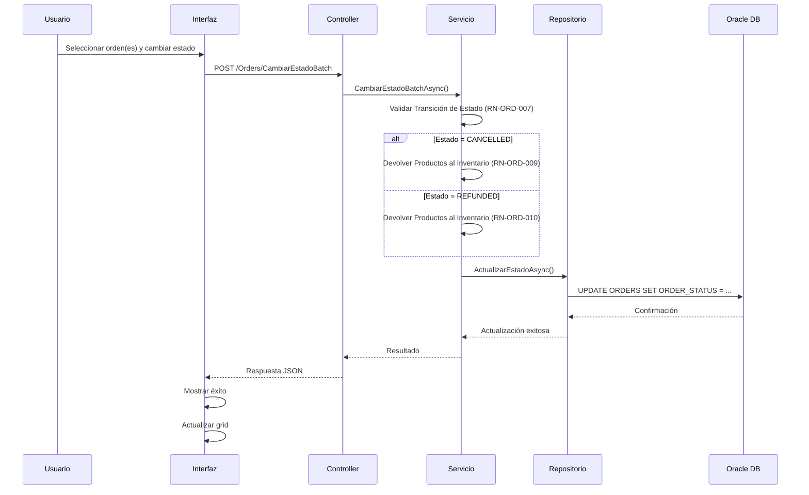

**Reglas de Negocio Aplicadas**:
- RN-ORD-007: Estados válidos y transiciones permitidas
- RN-ORD-009: Al cancelar, productos vuelven al inventario
- RN-ORD-010: Al reembolsar, productos vuelven al inventario

---

## Flujo de Gestión de Productos

### Consultar Productos

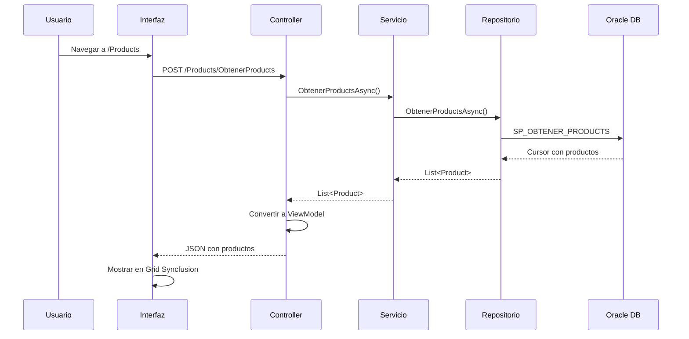

### Buscar Productos con Filtros

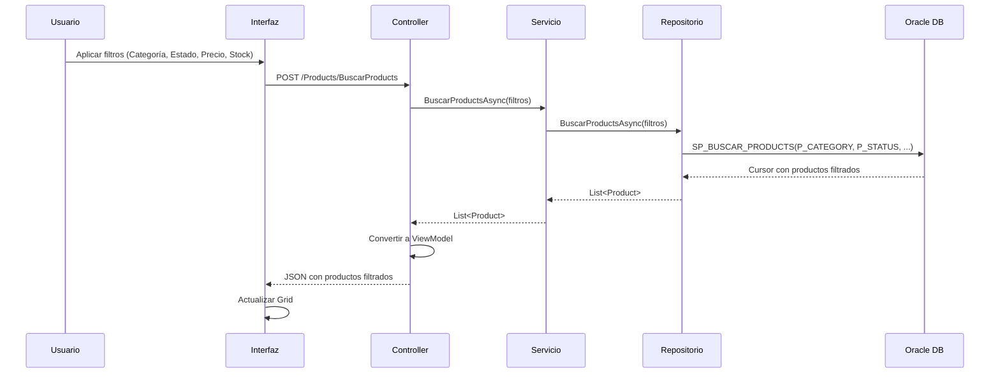

---

## Flujo de Gestión de Clientes

### Consultar Clientes

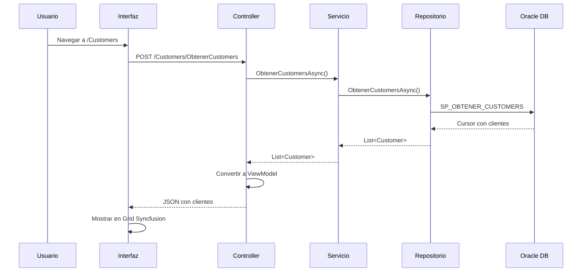

### Ver Detalles de Cliente

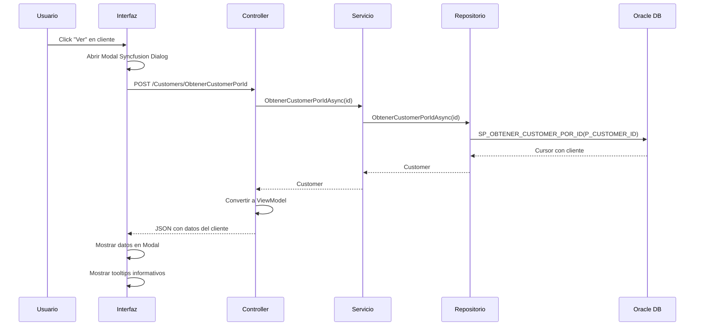

---

## Flujo de Facturación

### Visualizar Factura de Orden

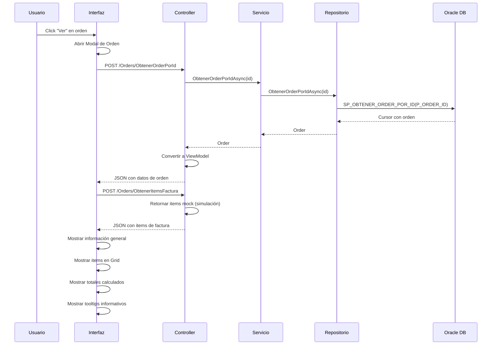

**Cálculos Aplicados**:
- Subtotal por item: `(Cantidad × Precio Unitario) - Descuento`
- Impuesto: `Subtotal × 0.16` (16% IVA)
- Total por item: `Subtotal + Impuesto`
- Total de orden: `Suma de todos los totales de items`

---

## Flujo de Inventario

### Consultar Stock de Productos

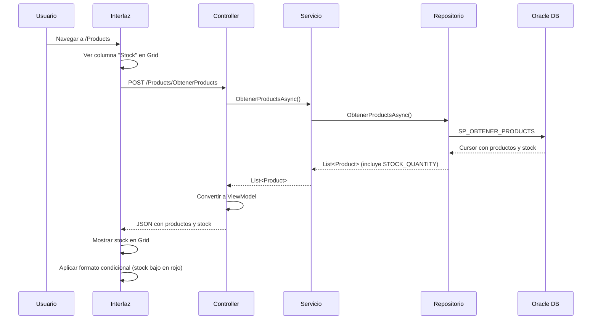

### Productos con Stock Bajo

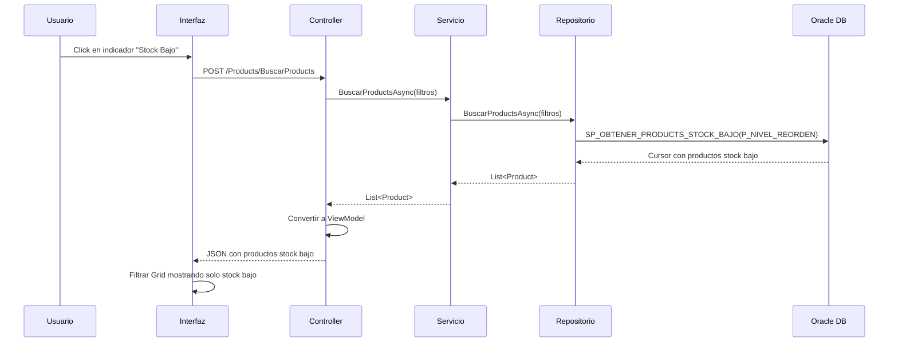

---

## Flujo de Dashboard

### Cargar Métricas del Dashboard

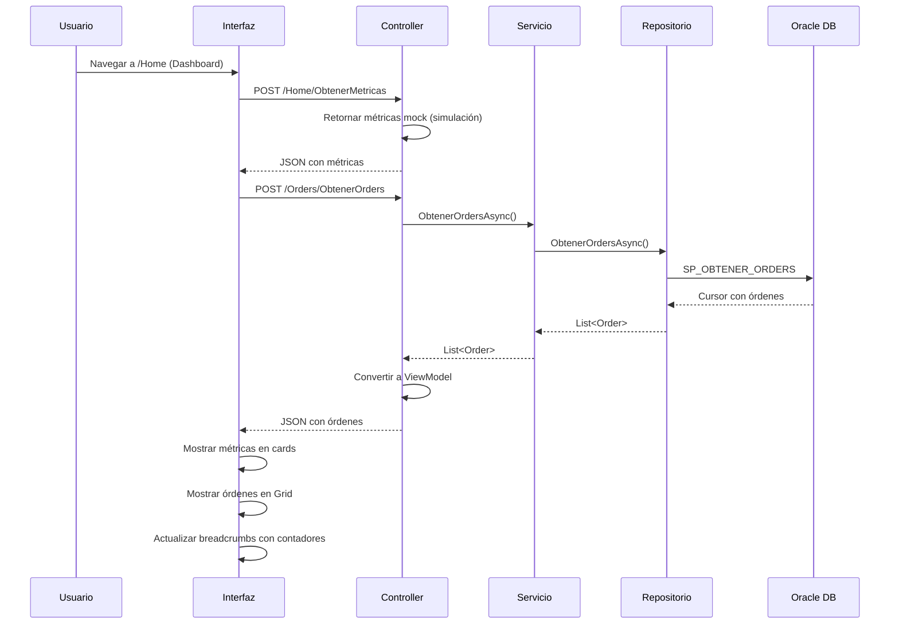

---

## Flujo de Exportación

### Exportar Datos a Excel/PDF

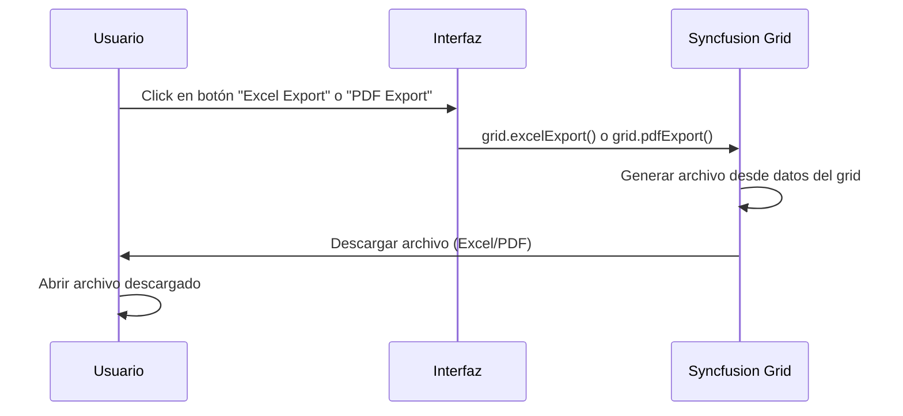

**Características**:
- Exporta solo los datos visibles en el grid
- Respeta filtros aplicados
- Incluye formato y estilos
- Nombre de archivo incluye fecha

---

## Flujo de Búsqueda y Filtrado

### Aplicar Filtros Avanzados

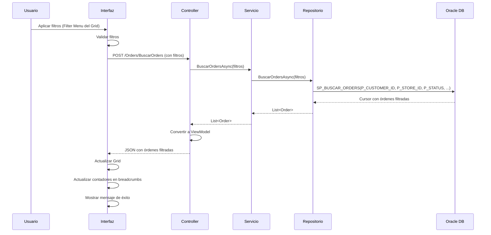

---

## Resumen de Flujos

### Flujos de Lectura (GET)
- Consultar órdenes, productos, clientes
- Ver detalles (modals)
- Cargar métricas del dashboard
- Exportar datos

### Flujos de Escritura (POST/PUT)
- Crear órdenes (futuro)
- Cambiar estado de órdenes
- Actualizar productos (futuro)
- Actualizar clientes (futuro)

### Flujos de Validación
- Validar stock disponible
- Validar cliente activo
- Validar transiciones de estado
- Validar precios

---

**Última actualización**: 2026-01-18
